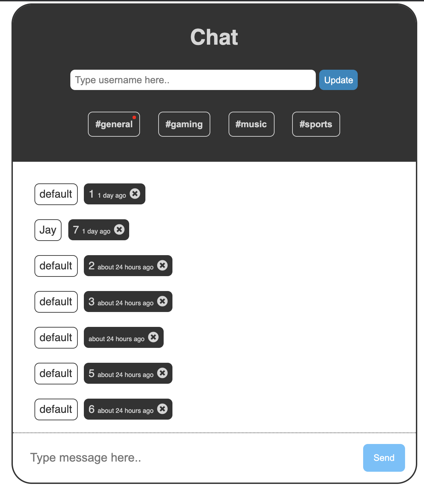
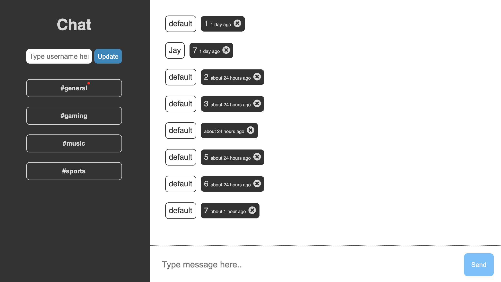

#
## Info
- Title : Chat app (database)
- Author : JM WOO
- GitHub : https://github.com/jayxwoo/pj__web-app__5-chat-app--database
- Link : https://jayxwoo.github.io/pj__web-app__5-chat-app--database/
- Log : https://www.notion.so/5-Chat-app-database-34dca68ff133469e81eac64b42566b01

## Features
- Multiple chatrooms
- Chat-box (chat lists)
- Add chats
- Delete chats
- Username
- Local storage - store username 

## Skills
- HTML
- CSS
    - Responsive design
- JS
    - JS modules
    - Firebase / firestore
    - Local storage
    - date format library - date-fns

## Screenshots

